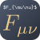

  

<h1 align=center>
  Logseq Live Math
</h1>

  <em>Type LaTeX in live mode!</em>

logseq-live-math integrates [MathLive](https://cortexjs.io/mathlive/) into Logseq, providing a better experience using Logseq with a lot of math.

> The above example uses [logseq-display-math](https://github.com/AllanChain/logseq-display-math) to render inline math in display style.

## How to use

There are 3 ways to trigger the MathLive input:

1. Using the `/math` command
2. Type `$$`
3. Select the formula with mouse (e.g. `$\frac12$`)

The latter two options can be turned of in the settings.
